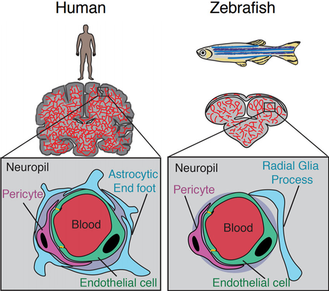
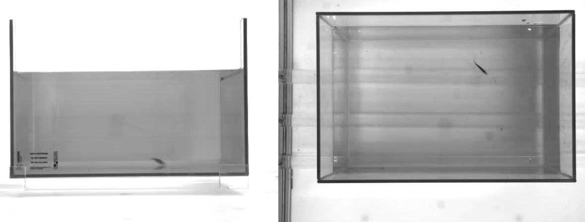

## **Decoding Behavioural Patterns**

**ML Across Temporal & Visual Domains**

**Adrian Valentin Panaintescu**

_Assistant Dr. Vlad Constantin Crăciun_

Master's Thesis

July 2025

---

## Contributions

  

    <a href="#about-paper-farm">
      
      

        Improving Automated Behaviour Analysis in Zebrafish Laboratory Trials
         
        Acta Physica Polonica A  <i>Springer</i>
      

    </a>
  

  

    <a href="#about-paper-farm">
      
      

      

        Clustering 3D Tracking in Zebrafish Laboratory Trials
         
        2024 E-Health and Bioengineering Conference  <i>IEEE</i>
      

      

    </a>
  

  

    <a href="#about-paper-cfg">
      
      

        DBI-Assisted Behaviour Classification of Malicious Binary Applications
         
        KES2025  <i>Springer</i>
      

    </a>
  

  

    <a href="#about-paper-vit">
      
      

        Comparing Vision Transformers Towards Automatic Bowel  Cleansing: A discussion
         
        KES2025  <i>ELSEIVER</i>
      

    </a>
  

--

### Acknowledgements

- POCU/993/6/13/153322
  - Faculty of Computer Science, Alexandru Ioan Cuza University
    - *Vlad Constantin Crăciun* [1,2,3,4]

  - Institute of Computer Science, Romanian Academy, Iași Branch
    - *Mihaela Luca* [1,2,4]
    - Adrian Ciobanu [4]

  - Center of Biomedical Research, Romanian Academy, Iași Branch
    - Radu Marian Lefter [1,2,4]
- Bitdefender
  - *Vlad Constantin Craciun* [1,2,3,4]
  - Mihai Leonte [3]
- Institute of Gastroenterology and Hepatology, St Spiridon Hospital
  - Vasile Liviu Drug [4]
- Grigore T. Popa University of Medicine and Pharmacy, Iași, Romania
  - *Radu Alexandru Vulpoi* [4]

---

### Motivation and How I started

- Initial goal: _Create an universal binary unpacking framework_
  - why? to help security researchers
- Phase01: **Behavioural analysis** as key for cybersecurity and biomedical research
- Shift from static approaches towards dynamic runtime analysis
- Goal: Create generalized behavioural models for diverse domains

---

### DBI-Assisted Behaviour Classification

  

  

    <ul style="text-align: left; font-size: 1em;">
      <li><strong>Goal</strong>: Detect malware via runtime behaviour, avoiding
        static fingerprinting.</li>
      <li><strong>Approach</strong>:
        <ul>
          <li>Trace execution using <strong>Intel PIN <abbr title="dynamic binary instrumentation">DBI</abbr></strong></li>
          <li>Extract <strong>Partial Control Flow Graphs (PFGs)</strong></li>
          <li>Convert traces to time series</li>
        </ul>
      </li>
      <li><strong>ML Pipeline</strong>:
        <ul>
          <li><strong>k-Means + DTW</strong> for family clustering</li>
          <li><strong>CNN-LSTM</strong> for supervised classification</li>
        </ul>
      </li>
      <li><strong>Results</strong>:
        <ul>
          <li>Identified 6 malware families</li>
          <li><strong>99.83%</strong> test accuracy</li>
        </ul>
      </li>
      <li><strong>Impact</strong>: Resilient to obfuscation; enables behavioural
        profiling</li>
    </ul>
  

---

### Dataset

- 641 sample (115 GB)
- 6 families of ransomware
  - Akira
  - Lockbit
  - Avaddon
  - Phobos
  - Crysis
  - Rhadamanthys
- clean samples
  - 18k for train
  - 135k for test

---

### Methodology & Flow

  

  

  * **DBI**(Dynamic Bynary Instrumentation) trace extraction
  * **PFG**(Partial Flow Control) constructions
  * Feature Extraction
  * Clustering with k-Means
  * Classification with CNN-LSTM

  

---

### DBI Trace Extraction

- Custom Intel **PIN tool** developed for execution tracing
- From raw execution traces to **Partial Control Flow Graphs (PFGs)**
- Behaviour encoded as structured time series data

--

### Feature Extraction

- DFS traversals of PFG using queue
- Queue size values yield on each node visit
- Normalization PFG traversals lengths 500 with Haar Wavelet

---

### Malware Clustering with k-Means

- Time series clustered using DBA
  - DynamicTimeWarping Barycenter Averaging
- 6 clusters discovered, aligned with AV families
- Good separation observed

--

**k-Means with euclidean**

--

**k-Means with k-Shape**

--

**k-Means with DBA**

---

### Malware Classification via CNN-LSTM

- Deep learning model: hybrid CNN-LSTM architecture
- Classification accuracy: **99.83%**
- High performance even in large-scale datasets (135k samples)

---

### ML-Driven Zebrafish Behaviour Tracking

  

    
    
  

  

    <ul style="text-align: left; font-size: 0.8em;">
      <li><strong>Goal</strong>: Enable automated analysis of fish behaviour in lab settings</li>
      <li><strong>Approach</strong>:
        <ul>
          <li>Real-time tracking via <strong>FARM system</strong></li>
          <li>Extract 2D/3D movement features (speed, turns, trajectories)</li>
          <li>Detect patterns using <strong>K-Means</strong> and <strong>HMM</strong></li>
        </ul>
      </li>
      <li><strong>Experiments</strong>:
        <ul>
          <li>Zebrafish (95) and Goldfish (80) trials</li>
          <li>Unknown subjects: Healthy vs Sick vs Treated</li>
        </ul>
      </li>
      <li><strong>Results</strong>:
        <ul>
          <li>Robust multi-dimensional clustering</li>
          <li>Cross-species generalisation</li>
        </ul>
      </li>
      <li><strong>Impact</strong>: Provides reproducible ML pipeline for behavioural neuroscience</li>
    </ul>
  

---

### Zebrafish Tracking and Biomedical Relevance

  

  

  - Zebrafish as biomedical models
  - Automated behavioural analysis necessity
  - Limitations of existing commercial and open-source solutions

  

--

### Dataset Composition

- Two main datasets collected:
  - **Zebrafish trials**: 95 video samples
  - **Goldfish trials**: 80 video samples
- Each trial consists of ~4–5 minutes of 3D movement
- Unknown subjects: Healthy vs Sick vs Treated

---

### FARM Framework for Real-time Monitoring

- Modular and open-source solution: **FARM**
- Real-time 2D/3D behavioural metrics
- Simple, low-cost setup for reproducibility

--

--

--

---

#### Behavioural Pattern Analysis in FARM

- **Temporal and spatial features** extracted from 2D/3D motion data:
  - Speed, direction, turning angles, acceleration
- **Unsupervised clustering**:
  - K-means for initial behavioural grouping
  - K-shape for time-series clustering with shape-based distance
- **Supervised classification**:
  - Hidden Markov Models (HMMs) trained on clustered sequences

--

**The k-Means silhouette analysis**

**zebrafish**

--

**The k-Means silhouette analysis**

**goldfish**

--

---

### 3D motion data

--

### 3D motion pipeline

--

### 3d cube segementation & features

  

  

  * 7 segments
  * 48 features 
    * resampled to 20 using Scaler Mean Variance

  

--

**hmm on 60/40 for zebrafish**

--

**hmm on 60/40 for goldfish**

---

### FARM System Results

- **High clustering cohesion** observed using silhouette scores on K-means and K-shape clusters
- **Accurate behaviour classification** using HMM:
  - Precision and recall over 90% on labelled zebrafish data
- **Cross-species applicability**:
  - Successfully extended from zebrafish to goldfish trials

---

### ViT benchmarking on BBPS clasification

  

  

    <ul style="text-align: left; font-size: 1em;">
      <li><strong>Goal</strong>: Benchmark <strong>Vision Transformer (ViT)</strong> models on medical image classification.</li>
      <li><strong>Use Case</strong>: Frame-level classification of colonoscopy images using <strong>BBPS scale</strong>.</li>
      <li><strong>Datasets</strong>: CVC-ClinicDB, C3VD</li>
      <li>20 ViT-based and non-ViT models</li>
      <li><strong>Hardware</strong>: RTX 4080, A100</li>
      <li><strong>Best by F1 Score on C3VD</strong>:
      <ul>
        <li>0.456 <strong>ViT Small ResNet50d S16 224</strong> (timm): best overall</li>
        <li>0.376 <strong>SAMViT Base Patch16</strong> (Meta): strong performance without pretraining</li>
        <li>0.333 <strong>Tiny ViT 5M</strong> (Microsoft): best-performing small pretrained ViT</li>
      </ul>
      </li>
    </ul>
  

---

### Vision Transformers (ViT) for Medical Classification

- Target task: classify colonoscopy frames based on **Boston Bowel Preparation Scale (BBPS)**
- Motivation:
  - Frame-level predictions aid in automated quality assessment
  - Supports real-time feedback during colonoscopy procedures
- Dataset: Frame-labelled images from colonoscopic videos

---

### ViT Dataset Characteristics

- **CVC-ClinicDB**: Polyp and clean colonoscopy frames, 612 images
- **C3VD**: More diverse content, multi-class setup
- Frames annotated by clinicians based on BBPS scale
- Distribution:
  - Class imbalance addressed via stratified sampling and augmentation

---

### Vision Transformer Models

- 20 models benchmarked:
  - MaxViT, SAMViT, ViT variants (Base, Tiny, RelPos), ConViT, MobileViT, etc.
- All models trained with:
  - Resolution: 224×224
  - Optimizer: AdamW
- Evaluated for:
  - Accuracy
  - Per-class F1-score
  - AUC

---

### ViT Benchmarking Results

- Best performing models clearly identified
- Highest accuracy on multi-class colonoscopy dataset
- Practical insights for model deployment

--

| ID | Model Name                    | F1     | Small | Pretrained | ViT | Vendor    |
|----|-------------------------------|--------|-------|------------|-----|-----------|
| 10 | tiny_vit_5m_224               | 0.3328 | ✓     | ✓          | ✓   | Microsoft |
| 14 | vitamin_small_224             | 0.3315 | ✓     | ✓          | ✓   | Google    |
| 9  | vit_relpos_small_patch16_224  | 0.3306 | ✓     | ✓          | ✓   | Google    |
| 13 | vitamin_base_224              | 0.3301 | ✗     | ✓          | ✓   | Google    |
| 3  | deit_tiny_patch16_224         | 0.3300 | ✓     | ✓          | ✓   | Facebook  |
| 1  | maxvit_base_tf_224            | 0.3297 | ✗     | ✓          | ✓   | Google    |
| 2  | maxvit_tiny_tf_224            | 0.3276 | ✓     | ✓          | ✓   | Google    |
| 6  | vit_base_resnet26d_224        | 0.3005 | ✗     | ✗          | ✓   | timm      |
| 5  | vit_base_mci_224              | 0.3247 | ✗     | ✓          | ✓   | Facebook  |
| 12 | vit_tiny_patch16_224          | 0.2464 | ✓     | ✓          | ✓   | Google    |
| 11 | vit_small_resnet50d_s16_224   | 0.4556 | ✗     | ✗          | ✓   | timm      |
| 17 | convnext_base                 | 0.2400 | ✗     | ✓          | ✗   | Facebook  |
| 4  | swin_tiny_patch4_window7_224  | 0.3321 | ✓     | ✓          | ✗   | Microsoft |
| 16 | convit_base                   | 0.3297 | ✗     | ✓          | ✓   | Facebook  |
| 8  | vit_relpos_base_patch16_224   | 0.2432 | ✗     | ✓          | ✓   | Google    |
| 18 | mobilevit_s                   | 0.3228 | ✓     | ✓          | ✗   | Apple     |
| 19 | efficientformer_l1            | 0.3200 | ✓     | ✓          | ✗   | Apple     |
| 15 | samvit_base_patch16_224       | 0.3755 | ✗     | ✗          | ✓   | Meta      |
| 7  | vit_medium_patch16_clip_224   | 0.2366 | ✗     | ✓          | ✓   | OpenAI    |
| 20 | vitamin_small_224 (duplicate) | 0.3315 | ✓     | ✓          | ✓   | Google    |

---

### Cross-Domain Analysis and Generalization

- Behavioural modelling techniques successfully adapted across:
  - Cybersecurity (malware analysis)
  - Biomedical (zebrafish)
  - Medical imaging (colonoscopy classification)
- Shared methods (CNN-LSTM, ViT) and domain-specific adjustments

---

### Conclusion and Contributions

- Unified behavioural analysis using ML
- DBI for robust malware detection
- FARM as an accessible biomedical research tool
- ViT benchmarking for medical classification

---

### Future Work

- Extending DBI analysis for evasive malware
- FARM enhancements: broader species and behaviors
- Fine-tuning ViTs and multimodal approaches
- Explainability and interpretability in ML models

---

## Q&A

**Thank you for your attention!**

Questions and discussions
